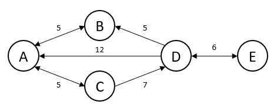
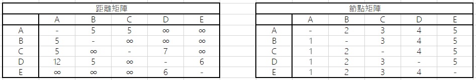
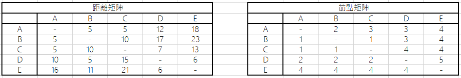
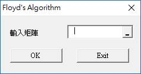
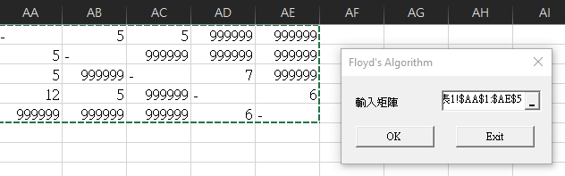
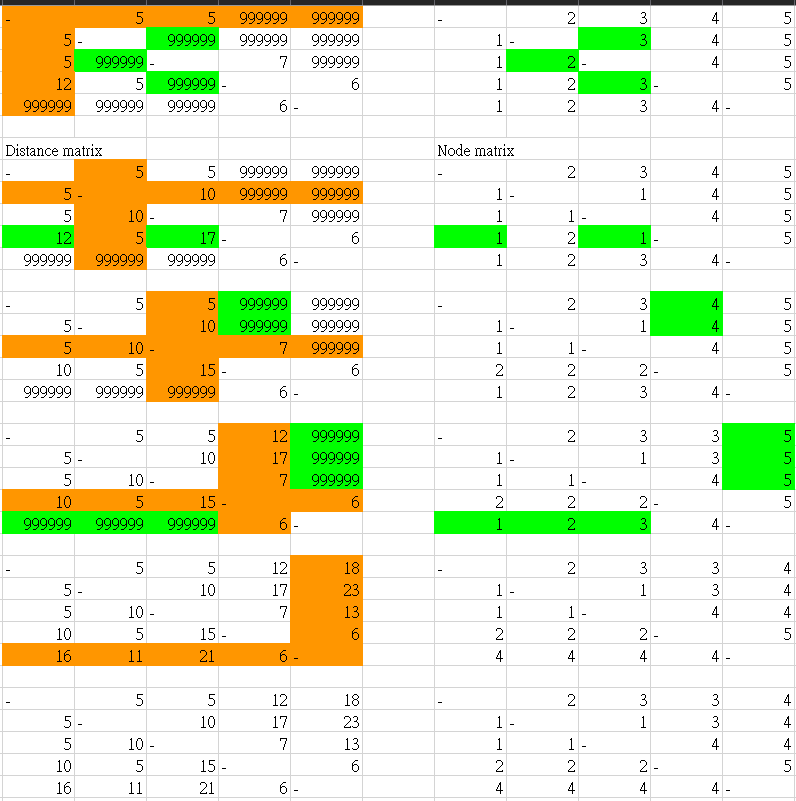

# VBA Practice - Floyd's Algorithm #

## Abstract ##

**Title:** VBA Practice - Floyd's Algorithm

**Auther:** Zachary Lin

※ 內文著重於實作。

※ 請留意，文中數學公式在瀏覽器頁面中可能無法正確顯示。

## Table of Contents ##

- [VBA Practice - Floyd's Algorithm](#vba-practice---floyds-algorithm)
  - [Abstract](#abstract)
  - [Table of Contents](#table-of-contents)
  - [Introduction](#introduction)
  - [Guidance](#guidance)

## Introduction ##

Floyd’s Algorithm 是一種各點間尋找最短路徑的演算法。它利用兩個矩陣進行計算，一是「距離矩陣（Distance Matrix）」；另一是「節點矩陣（Node Matrix）」。其中距離矩陣用來表示各點間的距離，節點矩陣則用來描述各點間的連接、路徑關係。

在初始的距離矩陣中，無法一次抵達的節點，以無窮的符號標示；而在初始的節點矩陣中，第一行（column）元素固定為 1，第二行元素固定為 2 ...，以此類推。且不論是距離矩陣或是節點矩陣，皆不計節點到節點本身。

現設節點數量為 $n$ ，則距離矩陣 $D$ 與節點矩陣 $N$ 應為兩個 $n × n$ 的方陣。

接著取第 $k$ 列（row）、第 $k$ 行作為計算基準（ $k$ 從 1 到 $n$ ），檢查元素 $D_{ij} > D_{ik} + D_{kj}$ 是否為真，其中 $i, j \ne k$ 。若結果為真，則下一個距離矩陣的元素 $D^\prime_{ij} = D_{ik} + D_{kj}$ ，且下一個節點矩陣的元素 $N^\prime_{ij} = k$ 。完成所有迭代後，所得的矩陣即為所求。

舉個例子實作一次，假設現有 5 個節點尋找最短路徑，且節點路徑圖如下所示：

依照規則，初始的距離矩陣與節點矩陣表示如下：

可以發現節點 $B$ 與 $D$ 為單向路徑，因此 $D$ 到 $B$ 的距離為 5，而 $B$ 到 $D$ 的距離則為無窮。

現在我們將 $k$ 設為 1 開始檢查距離矩陣內各個元素是否符合 $D_{ij} > D_{ik} + D_{kj}$ 的條件，例如 $D_{2, 3} = ∞$ 大於 $D_{2, 1}$ 與 $D_{1, 3}$ 之和的 10，因此 $D^\prime_{2, 3} = 10$ ，且 $N^\prime_{2, 3} = 1$ 。反覆執行，直到結束所有迭代。

完成演算後的結果如下：

現在就可以根據上面的矩陣回答下列問題：

1. 試問點 $A$ 到 $B$ 的距離為？需要經過哪些節點？

2. 試問點 $A$ 到 $D$ 的距離為？需要經過哪些節點？

3. 試問點 $B$ 到 $E$ 的距離為？需要經過哪些節點？

其解答如下：

1. 距離為 5（從距離矩陣查得），移動一次即可到達點 $B$ （節點矩陣中的數字 1 代表 $A$ 、2 代表 $B$ ...，以此類推）。

2. 距離為 12，移動的點依序為 $A$ 、 $C$ 、 $D$ 。先查節點矩陣得知 $A$ 到 $D$ 要先經過 $C$ ，再查 $A$ 到 $C$ 發現為直達，因此答案為 $A$ 、 $C$ 、 $D$ 。

3. 距離為 23，移動順序為 $B$ 、 $A$ 、 $C$ 、 $D$ 、 $E$ 。

## Guidance ##

使用者只需要將距離矩陣填入 Excel 表單中，再利用本程式的 RefEdit 選取距離矩陣所在的 Range 即可。

自訂表單樣板如下

選取距離矩陣所在的 Range，須注意先前以無窮符號表示的地方，現在需要用一個很大的數取代，如下圖：

按下 OK 按鈕後即可得到計算過程與最終的解答，如下圖所示：

